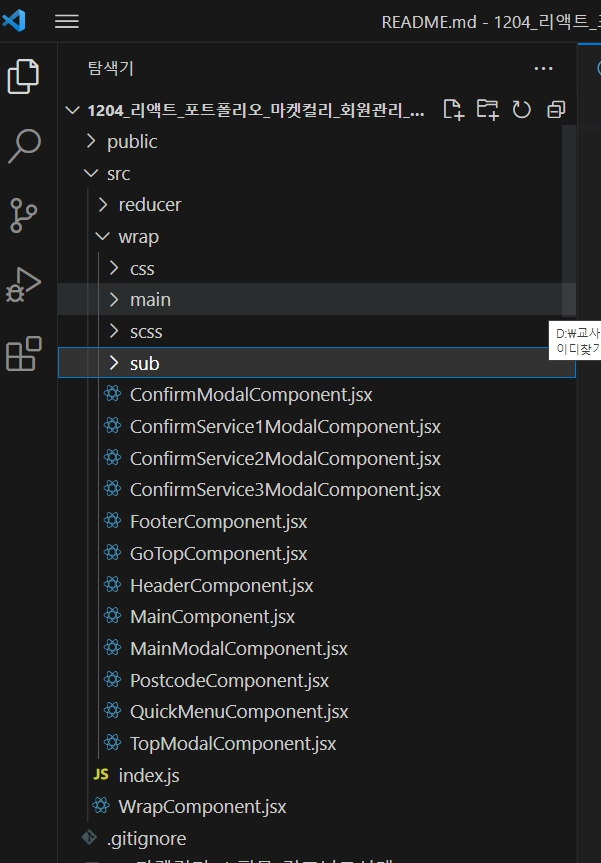

마켓컬리(Market Kurly) Portfolio
===


# Project 제작 툴(Tool)

## 프론트앤드(Front-End)
- Create React App
- SASS
- Redux
- Router


## 백앤드(Back-End)
- TypesSript
- Node
- php
- MySQL


## 배포(Deploy)

- GitHub
- GitBash
- Deploy1 &nbsp; : &nbsp; [Netlify Deploy][Netlify]

  [Netlify]: https://app.netlify.com/user/settings 

- Deploy2 &nbsp; : &nbsp; [GiHub Deploy][url]

  [url]: https://github.com/moonjongjs/marketKurly_react_cra


---

### 최상위 컴포넌트
---
- 최상위 컴포넌트 이미지

---

- 최상위 컴포넌트 이미지


---
</img>
---

#### 리덕스(Redux Toolkit)
- ###### Reducer Codding
```js
    import { createSlice } from "@reduxjs/toolkit";
    const initState = {
        주소: ''
    }
    const addressReducer = createSlice({
        name:'address',
        initialState: initState,
        reducers: {
            address: (state, action)=>{
                state.주소 = action.payload;
            }
        }
    });
    export default addressReducer.reducer;
    export const {address} = addressReducer.actions;
```

